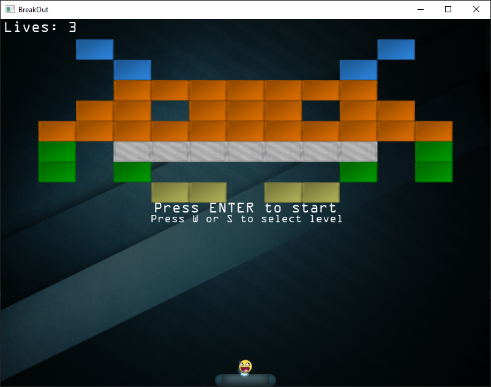

# BreakOut

A game based on a classic 2D game released in 1976 on the Atari 2600 console, BreakOut.

Developed using C++ and OpenGL, and following the guidelines presented on the book [LearnOpenGL](https://learnopengl.com/In-Practice/2D-Game/Breakout).

